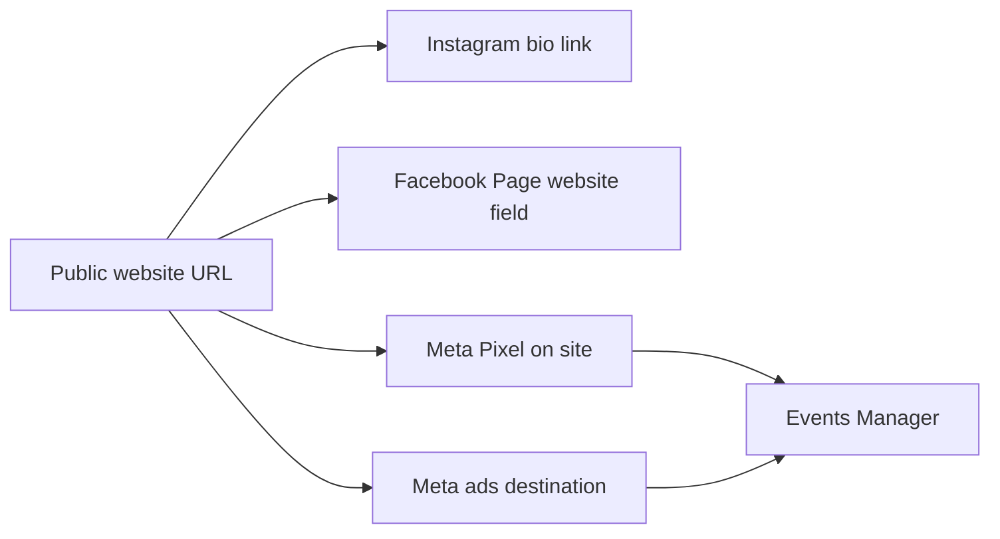

# Facebook and Instagram marketing plan (Villa Sinodium site)

Static site: `index.html`, `styles.css`, `script.js`. This document covers public URL, organic presence, paid ads, **Meta Pixel** measurement, optional **GA4**, and EU-oriented **cookie consent** — plus implementation tickets.

## Task tracker (high level)

- [ ] Confirm GitHub Pages URL; update canonical + `og:url` + `og:image` + `twitter:image` in `index.html`
- [ ] Create Facebook Page, Instagram (pro), connect IG to Page; website field + bio = site URL
- [ ] Posting pillars (property, location, prices, season); schedule via Business Suite
- [ ] **SITE:** `privacy.html` + cookie consent; load Pixel only after marketing consent (EU)
- [ ] **SITE:** Meta Pixel base + Lead + ViewContent (prices); verify in Test Events
- [ ] **META:** Business Portfolio, ad account, payment, Pixel in Events Manager, domain verification
- [ ] **ADS:** Special category if required, creatives, destination URL, optimization event, launch
- [ ] Replace placeholder contact in `index.html`; link privacy policy in footer
- [ ] Optional: custom domain + DNS + GitHub custom domain + refresh meta URLs

---

## What you are connecting

Your site is a **static one-pager** (`index.html`, `styles.css`, `script.js`). Marketing on Meta always needs a **single canonical web address** people can open on a phone: either **`https://<user>.github.io/<repo>/`** or, later, a **custom domain**. Same URL goes in Instagram bio, Facebook Page “Website,” and ad destinations.

**To measure paid campaign success**, you add **Meta Pixel** (browser JavaScript) so Meta can attribute visits and **conversion events** (e.g. “clicked contact”) back to ads. Optionally add **Google Analytics 4** for a second view of traffic and UTM breakdown.

---

## What to implement on the website (measurement)

| Piece | Purpose | Where |
| ----- | ------- | ----- |
| **Meta Pixel (base code)** | Page views, ad attribution, audiences, optimization | Snippet in `index.html` or small loader script; **only after consent** if you target EU |
| **Standard event: PageView** | Default with Pixel | Automatic |
| **Standard event: ViewContent** | “Interested in offer” proxy — e.g. user scrolled to **#prices** or **#contact** | Fire from `script.js` (Intersection Observer or section visibility) |
| **Standard event: Lead** (or **Contact**) | Strong signal: click **mailto:** or **tel:** in Contact block | Click listeners on those `<a>` tags |
| **Cookie consent banner** | EU/UK: load Pixel **after** opt-in to marketing cookies | New small UI + `localStorage` (or use a CMP later if you scale) |
| **privacy.html** (or `/privacy`) | Describe Pixel, data sent to Meta, retention, rights | Static page linked from footer |
| **Optional: GA4 (`gtag.js`)** | Traffic by source/medium/campaign (UTMs), funnels outside Meta | Second snippet; same consent gate recommended |
| **UTM on ad links** | Readable campaign names in GA4 (Meta also adds `fbclid`) | Set in Ads Manager when building URLs (optional but useful) |

**Conversions API (server-side)** improves reliability vs. ad blockers but needs a **server** or **serverless** endpoint — skip for v1 on pure GitHub Pages unless you add e.g. Cloudflare Worker / third-party relay later.

**“Success” in Meta** = pick **one primary optimization event** (often **Lead** after you implement contact clicks, or **ViewContent** for softer funnel) and use it in a **Sales / Leads / Engagement** campaign that optimizes for that event once the Pixel has enough signal.

---

## Implementation plan (order of work)

1. **Stable public URL** — Phase A below; fix OG URLs in `index.html`.
2. **Legal surface** — Draft `privacy.html`, link from site footer; state Meta Pixel, purposes, contact.
3. **Consent** — Banner: Reject / Accept marketing; store choice; **do not** inject Pixel until Accept (or use “strictly necessary only” until then).
4. **Pixel** — Create Pixel in Meta **Events Manager**; copy Pixel ID; add base code behind consent.
5. **Custom events** — In `script.js`: `Lead` on `mailto`/`tel` clicks; `ViewContent` when `#prices` (and optionally `#contact`) enters viewport.
6. **Verify** — Events Manager **Test Events** (browser + test code); confirm events fire on mobile.
7. **Domain verification** — In Events Manager / Business Settings, verify domain for your site URL (required for some optimizations and iOS scenarios).
8. **Ads** — Follow ticket list below; choose campaign objective and optimization event matching what you implemented.

---

## Phase A — Site must be public and stable

1. **GitHub Pages live** — Repo **Settings → Pages**: branch `main`, folder `/ (root)`; confirm the site loads on mobile (images, map, contact section).
2. **Pick one URL** — Use the exact `https://...` you will keep for months (changing it later breaks old posts and ad history).
3. **Align Open Graph with that URL** — In `index.html`, replace `villa-sinodium.example.com` in `canonical`, `og:url`, `og:image`, and `twitter:image` with your **real public base URL** (including path if the site is under `/RepoName/`).

---

## Phase B — Meta accounts and assets (do this once)

1. **Personal Facebook account** — You need a real profile to manage a Page (Meta’s rule).
2. **Facebook Page** — Create a **Page** for the villa (category e.g. vacation home rental / lodging). Add profile/cover photo, **Website** = public site URL, short About.
3. **Instagram** — **Business** (recommended for ads) or creator; connect to the Facebook Page.
4. **Meta Business Suite** — [business.facebook.com](https://business.facebook.com) for unified inbox and scheduling.

---

## Phase C — Organic marketing (no ads yet)

- **Instagram:** bio link = site URL; mix Reels/posts (property, location, prices, season); “link in bio” for stories where links are limited.
- **Facebook:** Page posts aligned with same pillars; clear how to contact.

---

## Phase D — Paid ads (conceptual; details in tickets below)

- Use **Ads Manager**, payment method, creatives that match the site.
- **Housing / special ad category:** vacation rentals can fall under restricted categories in some regions — confirm Meta’s current rules when you create the campaign.
- **Optimization:** optimize for **Lead** (or **ViewContent**) only after Pixel fires reliably and Events Manager shows volume.

---

## Phase E — Trust and legal

- **Real contact** in `index.html` (replace placeholders).
- **Privacy + cookies** required once Pixel (or GA4) runs for EU-facing marketing.

---

## Phase F — Optional custom domain

- DNS → GitHub Pages custom domain → HTTPS → refresh all `og:` / `canonical` URLs in `index.html` → redo **domain verification** in Meta.

---

## Tickets / chunks (copy into your task tracker)

### Site — tracking and compliance

- **SITE-1 — Privacy policy page**  
  Add static `privacy.html` (or section): what data Meta/GA collect, why, retention, your contact, link in footer of `index.html`.

- **SITE-2 — Cookie consent**  
  Minimal banner: marketing off by default; on Accept, set flag in `localStorage` and inject Pixel (and GA4 if used). Document “Reject” = no marketing scripts.

- **SITE-3 — Meta Pixel base**  
  After consent, load Pixel with your ID from Events Manager; confirm **PageView** in Test Events.

- **SITE-4 — Conversion-style events**  
  `Lead` (recommended) on **mailto** and **tel** clicks in the Contact section; optional `ViewContent` when **#prices** is visible (Intersection Observer in `script.js`).

- **SITE-5 — Optional GA4**  
  Property in Google Analytics, `gtag` behind same consent; optional UTM template for non-Meta channels.

- **SITE-6 — QA**  
  Desktop + mobile Safari/Chrome; ad blockers off; Events Manager Test Events + **Meta Pixel Helper** browser extension.

### Meta Business and Ads

- **META-1 — Business foundation**  
  Business Portfolio (if not already), **Ad account**, billing/payment method, assign yourself admin.

- **META-2 — Pixel and dataset**  
  Events Manager: create **Pixel**, connect to Ad account; note **Pixel ID** for SITE-3.

- **META-3 — Domain verification**  
  Verify your site domain (Meta provides DNS TXT or file upload; on GitHub Pages, DNS/file method depends on custom domain vs `github.io` — follow Meta’s current doc for your URL type).

- **META-4 — Campaign design**  
  Objective (e.g. Leads or Traffic → then optimize to **Lead** once available); **special ad category** if required for your region/vertical; audience and placements (Feed, Reels, etc.).

- **META-5 — Ad set: conversion event**  
  Choose optimization event = **Lead** (or **ViewContent** if volume is low); set attribution window Meta recommends for testing.

- **META-6 — Creatives and landing URL**  
  Final URL = canonical site URL (with optional UTMs for GA4); primary text, headline, CTA; match price/claims to `index.html`.

- **META-7 — Launch and monitor**  
  Small daily budget first; watch Events Manager (events per day), cost per **Lead**, frequency, rejections; adjust creative or audience after 3–7 days of data.

### Dependencies

- **META-2** before **SITE-3** (you need Pixel ID).
- **SITE-1 + SITE-2** before **SITE-3** if you want compliant EU launch.
- **SITE-3–4** before **META-5** if you optimize for web events.
- **META-3** can run in parallel once URL is final.

---

## Checklist summary

| Phase | Action |
| ----- | ------ |
| A | Pages URL works; OG/canonical in `index.html` |
| B | Facebook Page + Instagram + link |
| C | Organic posting |
| Tracking | Privacy + consent → Pixel → Lead/ViewContent → verify |
| Ads | META tickets → launch → optimize on chosen event |
| F | Optional custom domain + redo meta + domain verification |
